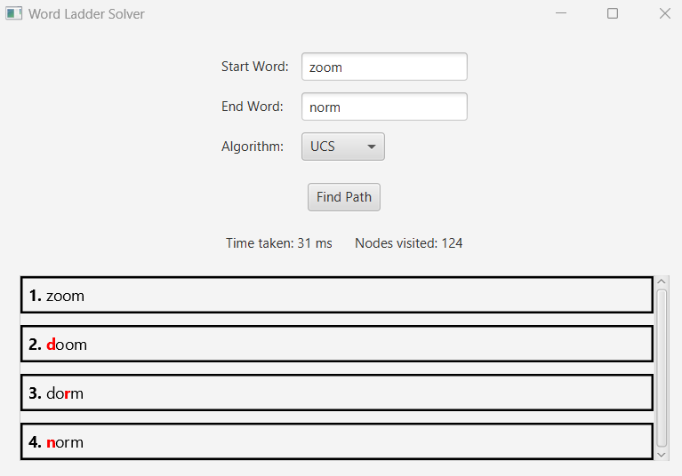
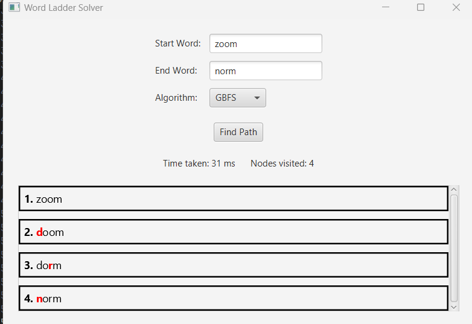
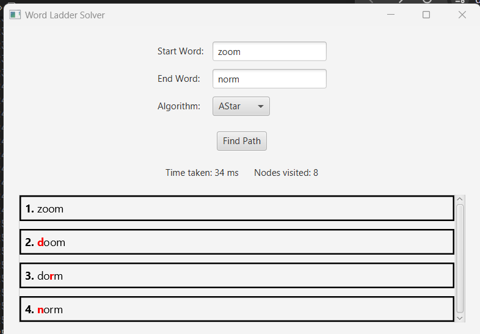
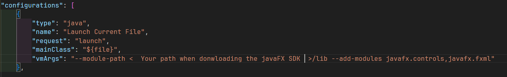

<h1 align="center">Tugas Kecil 3 IF2211 Strategy Algorithm</h1>
<h1 align="center">Sem II 2023/2024</h1>
<h3 align="center">Wiki Ladder Solver</p>


## Table of Contents

- [Overview](#overview)
- [Abstraction](#abstraction)
- [Built With](#built-with)
- [Installation With GUI](#installation-with-GUI)
- [Installation With CLI](#installation-with-CLI)
- [Creator](#creator)
- [Links](#links)

## Overview





<p>Lecturer : Dr. Ir. Rinaldi Munir, M.T.</p>

Here is the purpose of making this project :

- To fulfill project assignment for the IF2211 Strategy Algorithm course.
- To implement Uniform Cost Search(UCS), Greedy Best First Search(GBFS) and AStar(A\*) search algorithms to find the shortest path from one word to another word by changing only 1 letter.
- To provide developers with the opportunity to learn Java programming languange and SwingFX for creating desktop applications.
- To serve as a platform for developers to explore desktop app development, including the creation of algorithms and logic using the Java programming language.
- To contribute to technological advancement, particularly in the field of optimizing pathfinding.

## Abstraction

The Word Ladder Solver is a Java application that employs three distinct algorithms Uniform Cost Search (UCS), Greedy Best First Search (GBFS), and A\* (AStar) to find the shortest transformation sequence between two words, where each step involves changing a single letter to form another valid dictionary word. The project features a graphical user interface (GUI) developed using JavaFX, providing an intuitive platform for users to input start and end words, select an algorithm, and instantly view the results including the path taken, the number of nodes visited, and the execution time. This GUI enhances user interaction, making the solver accessible and easy to use while demonstrating the effectiveness of different algorithmic approaches in solving the Word Ladder problem.

## Problem Solving Steps with UCS Algorithm

1. Initialize the queue: Start by initializing a priority queue. Add the starting word with a cumulative cost of zero.
2. Set Up the Visited Set: Create an empty set to keep track of all visited nodes (words).
3. Loop Until queue is Empty: While the queue is not empty, continue with the following steps:
4. Choose the Lowest Cost Node: Remove the node (word) with the lowest path cost from the queue.
5. Check for Goal: If this node is the goal word, reconstruct the path from the start word to the goal word using the parent pointers and return the path.
6. Explore Neighbors: Generate all valid successors of the current word by changing one letter at a time to form other valid words (as per the dictionary).
7. Update the queue: For each successor that has not been visited or is already in the queue with a higher path cost, add it to the queue with the updated cumulative cost.
8. Mark as visited: Add the current node to the visited set.
9. Repeat: Continue this process until the goal is found or the queue is empty.

## Problem Solving Steps with GBFS Algorithm

1. Initialize the queue: Start with a priority queue that prioritizes nodes based on a heuristic estimate to the goal. Add the starting word with a heuristic cost.
2. Set Up the visited Set: Create an empty set to keep track of all visited nodes.
3. Loop Until queue is Empty: Continue processing while there are nodes in the queue.
4. Select the Most Promising Node: Remove the node (word) that appears most promising based on the heuristic from the queue.
5. Check for Goal: If this node is the goal word, reconstruct the path and return it.
6. Generate Successors: Produce all valid transformations of the current word by changing each letter to form other dictionary words.
7. Screen and Add to queue: For each successor not in the visited set or already in the queue with a higher heuristic cost, add to the queue.
8. Mark Node as visited: Add the current word to the visited set.
9. Repeat: Keep iterating until the goal is reached or no nodes remain.

## Problem Solving Steps with AStar Algorithm

1. Initialize the queue: Start with a priority queue. Add the starting word, calculating the cost as f(n) = g(n) + h(n) where g(n) is the cost from the start to n, and h(n) is the estimated cost from n to the goal.
2. Set Up the visited Set: Maintain an empty set for visited nodes.
3. Loop Until queue is Empty: Process nodes while the queue has elements.
4. Choose Node with Lowest f(n): Remove the node with the lowest f(n) value from the queue.
5. Goal Check: If this node is the goal word, reconstruct the path back to the start using parent pointers and return this path.
6. Expand Node: Generate all valid transformations by altering one letter at a time to create new words.
7. Update queue and Costs: For each valid successor, calculate f(n) = g(n) + h(n). If this successor is not visited or is in the queue with a higher f(n), update or add it with the new cost.
8. Add to visited: Place the current word in the visited set.
9. Repeat: Continue this loop until the goal is found or the queue is exhausted.

## Built With

- [Java](https://www.java.com/en/)
- [JavaFX](https://openjfx.io/)

## Prerequisites

To run this project, you will need to perform several installations, including:

- `Java 17` : This application requires minimum Java 17, which is the main programming language used to create this project.
- `Java FX` : This is a software platform used to create and deliver desktop applications, as well as rich internet applications that can run across a wide variety of devices. JavaFX is crucial for the GUI components of this project. Download according to your operating system.
- `Integrated Development Environment (IDE)` : An IDE that supports Java and JavaFX is recommended for ease of development(This project is developed using VSCode IDE).
- For Linux: The latest version of Java must be installed on your machine to compile and run the code. Ensure that the java version installed is non-headless or you can download it using `sudo apt install openjdk-17-jdk`

## Installation With GUI

Make sure JavaFX is installed on your system. If not, install [JavaFX](https://gluonhq.com/products/javafx/). For reference in installing JavaFX, you can use this youtube video [Tutorial on installing JavaFX](https://youtu.be/AubJaosfI-0?si=taFNsn2QVd0nHRxq). If JavaFX is already installed, follow these steps:

1. Clone this repository :

```shell
git clone https://github.com/AlbertChoe/Tucil3_13522081.git
```

2. Navigate to the root directory of the program by running the following command in the terminal:

```shell
cd ./Tucil3_13522081
```

3. run the following commands:

In Windows:

```shell
javac --module-path <path to your javaFX sdk path for example C:\Java\javafx-sdk-22.0.1>\lib --add-modules javafx.controls,javafx.fxml,javafx.graphics  -d bin src\*.java
```

```shell
java --module-path <path to your javaFX sdk path for example C:\Java\javafx-sdk-22.0.1>\lib --add-modules javafx.controls,javafx.fxml,javafx.graphics -cp bin Main
```

In Linux:
after you follow this 2 steps below if the gui is not showing then try this `export DISPLAY=:0.0` after that try again

```shell
javac --module-path <path to your javaFX sdk path for example /home/albert/javafx-sdk-22.0.1>/lib --add-modules javafx.controls,javafx.fxml,javafx.graphics -d ./bin src/*.java
```

```shell
java --module-path <path to your javaFX sdk path for example /home/albert/javafx-sdk-22.0.1>/lib --add-modules javafx.controls,javafx.fxml,javafx.graphics -cp ./bin Main
```

4. After successfully launching the application, users can choose the search algorithm, either using UCS, GBFS or AStar. Once the user selects the search algorithm, they need to enter the start word and the end word for the word ladder game. The program will display the result, along with execution time, and the number of nodes visited.

## If the gui is still not showing then try

1. follow this steps

```shell
click ctrl + shift + p

```

2. add this to you settings.json

```shell
"java.project.referencedLibraries": [
		"lib/**/*.jar",
		" < Your path when downloading the javaFX SDK >/lib/*"
	]
```

dont forget to change the path to your own JavaFX downloaded path.

3. Open launch.json file and change the path to your JavaFX SDK path you downloaded:



```shell
change the  < Your path when donwloading the javaFX SDK > into your own path where you donwloaded the JavaFX
```

4.  then try using F5 to run the Main.java

5.  After successfully launching the application, users can choose the search algorithm, either using UCS, GBFS or AStar. Once the user selects the search algorithm, they need to enter the start word and the end word for the word ladder game. The program will display the result, along with execution time, and the number of nodes visited.

## Installation With CLI

Follow these steps:

1. Clone this repository :

```shell
git clone https://github.com/AlbertChoe/Tucil3_13522081.git
```

2. Navigate to the src directory of the program by running the following command in the terminal:

```shell
cd ./Tucil3_13522081/src
```

3. Checkout to branch CLI by following the command below:
```shell
git checkout CLI
```

4. Run the following command:

```shell
javac Main.java
java Main
```

5. After successfully launching the application, users can choose the search algorithm, either using UCS, GBFS or AStar. Once the user selects the search algorithm, they need to enter the start word and the end word for the word ladder game. The program will display the result, along with execution time, and the number of nodes visited.

## Creator

| NIM      | Nama   | Kelas |
| -------- | ------ | ----- |
| 13522081 | Albert | K-01  |

## Links

- Repository : [https://github.com/AlbertChoe/Tucil3_13522081/](https://github.com/AlbertChoe/Tucil3_13522081)
